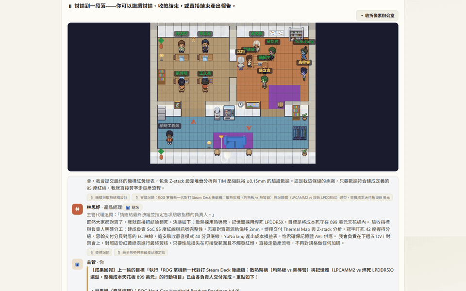
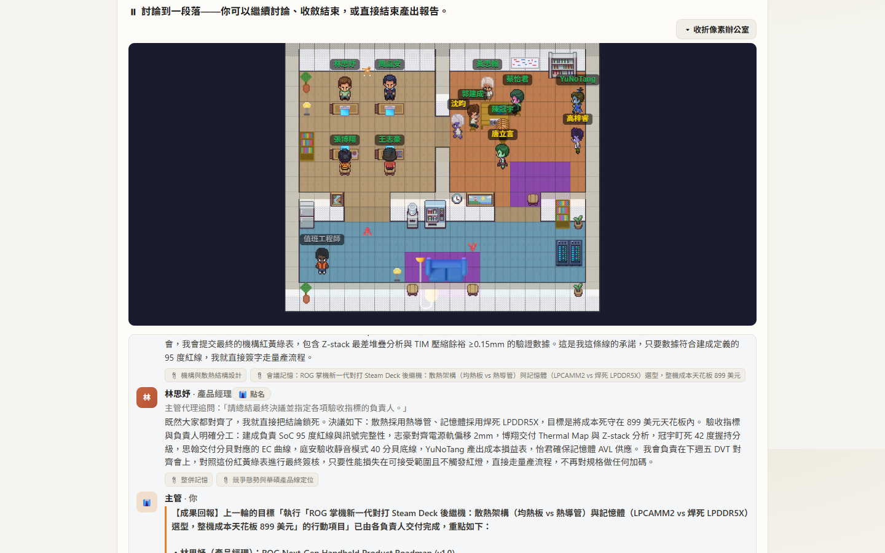
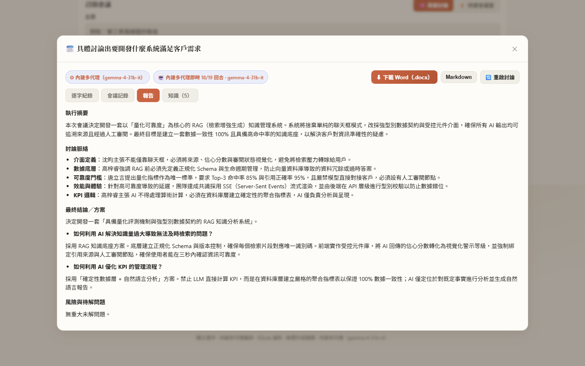

# 🧑‍💼 Subagent Virtual Employee System

[繁體中文](README.zh-TW.md) ｜ **English**

**Not another agent framework. A tiny AI company you can watch.**
Hire AI employees with personas and private knowledge bases, watch them debate in a pixel office, converge on real decisions, and actually deliver the work — fully local, your data never leaves your machine, and it even runs **without any API key**.




> **Note on language**: the app UI and agent output are currently **Traditional Chinese**. English UI is on the roadmap — contributions welcome! The codebase, docs and this README are English-friendly.

## What is this?

You are the **manager** of a virtual company. Each AI employee has a persona (personality, expertise, communication style) and a **private, searchable knowledge base (RAG)**. You can:

- 🗣️ **Hold multi-round meetings** — an AI chair plans who speaks next, employees push back on each other, you interject anytime, and the meeting ends with a decision report (docx/markdown export).
- ⚡ **Quick meeting room** — role-play-only fast reads when you just need a preliminary take.
- 🎯 **Assign goals** — action items from a meeting become an executable goal; each owner **actually does the work** (web research, citations) and delivers an artifact.
- 🔄 **Close the loop** — bring delivered results back into the source meeting; the team reviews *what was actually built* and converges on a final conclusion (no infinite task spawning).
- 🔬 **Autonomous research** — send an employee to research a topic online; approve the report into their knowledge base.
- 💬 **1-on-1s** — unlimited private conversations with any employee, resumable anytime.
- 🧠 **Organizational memory** — after each meeting, employees distill memories; memories consolidate (dedupe, reconcile) over time. Your team gets smarter the more you use it.
- 🖼️ **Multimodal input** — paste screenshots/whiteboard photos into meetings or chats (Gemini).
- 👾 **Pixel office** — watch your employees walk around, sit in meetings and type, in a live-animated office (MIT-licensed engine, vendored).

| Meeting room + pixel office | Decision report |
|---|---|
|  |  |

## Why people like it

- **$0 to start, no API key needed** — a deterministic offline engine runs the whole flow (meetings/goals/1on1/memory) with an honest "live ratio" badge; add a free-tier Gemini key when you want real brains.
- **Use your existing subscriptions as brains** — route through the official `claude` (Claude Pro/Max) or `codex` (ChatGPT Plus/Pro) CLIs on your own machine. No extra API bill.
- **Truly local-first** — single-file SQLite (built-in `node:sqlite`, zero native builds), FTS5 + optional pure-JS vector hybrid retrieval (RRF). Backup = copy one folder.
- **One-click** — Windows `start.bat` auto-installs everything, or build a single portable `.exe` (~95 MB, no Node required on the target machine).
- **An app, not a framework** — no Python, no YAML, no code to write. Download and run.

## ⚡ Quick start

### Windows (one-click)

1. Install [Node.js](https://nodejs.org/) (>= 22.5)
2. Clone or download this repo
3. **Double-click `start.bat`** — done!

First run installs dependencies, builds the web UI, seeds a **default team of 12 AI employees** (a full hardware product-development team, each with sourced 2025–2026 background knowledge), and opens your browser. Subsequent runs skip completed steps; your data persists.

### Windows (single .exe, no Node needed)

```bash
npm run build:exe    # → dist-exe/虛擬員工系統.exe (~95 MB, self-contained)
```

Copy the exe to any Windows machine and double-click. Data lives in `veemp-data\` next to the exe. PDF/DOCX parsing auto-installs in the background if Python 3.11–3.13 is present.

### macOS / Linux

```bash
git clone https://github.com/hoyoboy0726123/subagent-virtual-employee-system.git
cd subagent-virtual-employee-system
npm install
npm run seed                 # seed the default team (first time; resets the DB)
npm run setup:markitdown     # optional: PDF/DOCX parsing (needs Python 3.11–3.13)
npm run serve                # build + start → http://localhost:3001
```

### Docker

```bash
docker compose up          # one command → http://localhost:3001
```

or manually:

```bash
docker build -t veemp .
docker run -p 3001:3001 -v veemp-data:/app/server/data veemp
# add --build-arg WITH_MARKITDOWN=1 for PDF/DOCX upload parsing
```

> Exposing the port beyond localhost? Set `AUTH_TOKEN` — see [SECURITY.md](SECURITY.md).

## 🧠 Brains (LLM providers)

| Provider | What you need | Notes |
|---|---|---|
| **None** | nothing | Deterministic offline engine — full flow works, zero cost |
| **Google Gemini API** | a free-tier API key | Default live brain; the only multimodal (image) path |
| **Claude subscription** | `claude` CLI logged in | Uses your Claude Pro/Max quota, no API billing |
| **Codex subscription** | `codex` CLI logged in | Uses your ChatGPT Plus/Pro quota, no API billing |

Switch anytime from the top bar; the UI live-detects what's available. Subscription routing is **single-user, local-machine only** — see [SECURITY.md](SECURITY.md).

## 🏛️ Architecture (for developers)

- **Backend**: Node >= 22.5 + Express, built-in `node:sqlite` (FTS5, CJK bigram tokenization), no native builds. Layered `routes → services → storage → db`.
- **Frontend**: React 18 + Vite, SSE streaming for live meeting turns.
- **Orchestration** (`server/src/orchestration/`): each employee is an in-app agent (persona system prompt + own RAG grounding + per-round stance); a chair agent plans each round's speaking order in one LLM call; a synthesizer writes the decision report from the real transcript.
- **Retrieval**: BM25 by default; optional local embeddings enable BM25+vector hybrid fused with RRF.
- **Memory**: post-meeting distillation + threshold-triggered consolidation (LLM semantic merge with deterministic fallback, non-destructive archival).
- **Tests**: 8 hermetic smoke suites (61 checks), CI on Node 22/24. `npm test`; coverage via `npm run test:coverage` (~87% lines).

More: [CONTRIBUTING.md](CONTRIBUTING.md) ・ [SECURITY.md](SECURITY.md)

## 🗺️ Roadmap

- [ ] English UI (i18n layer) — **help wanted**
- [ ] Ollama / OpenAI-compatible local model support
- [ ] Scenario packs (one-click team templates: marketing dept, paper review committee, D&D party…)
- [ ] Public-deploy hardening (auth token, rate limiting)
- [ ] GitHub Releases with prebuilt exe

Ideas and PRs welcome — check [issues](https://github.com/hoyoboy0726123/subagent-virtual-employee-system/issues) or open a discussion.

## 📄 License

[MIT](LICENSE). Pixel office engine vendored from an MIT-licensed upstream (see `client/src/pixel-office/NOTICE.md`).
